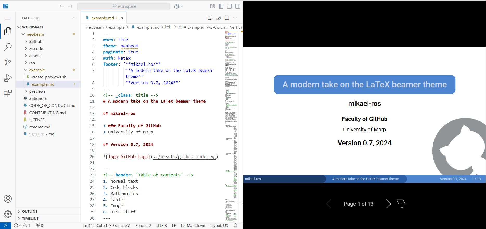

# 🎥 Demo


# 🚀How to Deploy

```bash
sudo docker-compose up -d
```

# 🌐How to Use

Open your browser and visit:

`http://localhost:38888` (for local use), or

`http://your-ip-address:38888` (for access from other devices)

The __left pane__ shows a VS Code editor (code-server), and the __right pane__ displays a live-refresh output from the Marp slide server.

The `sudo` password for the VS Code editor is: `code-server`

In the VS Code editor terminal at `/config/workspace`, you can run `git clone https://other.theme.git` to clone community themes listed on [Awesome Marp](https://github.com/marp-team/awesome-marp).

# 🧹How to Stop and Clean Up

```bash
sudo docker-compose down
```